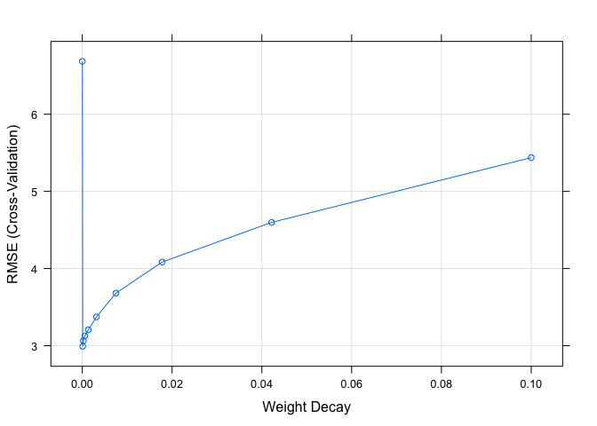
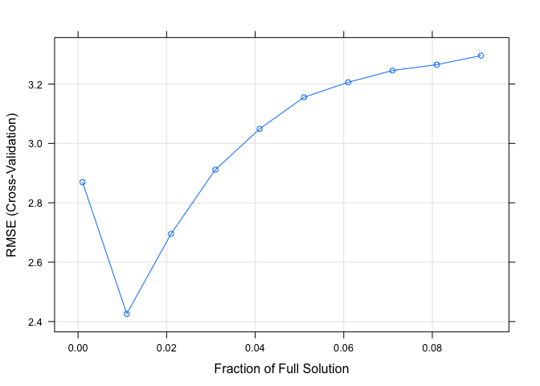
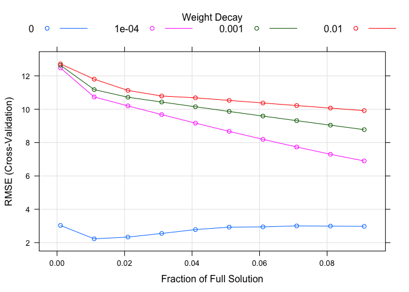
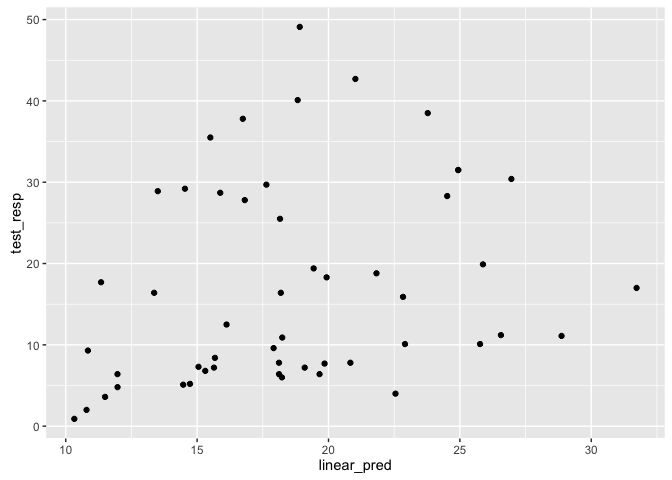
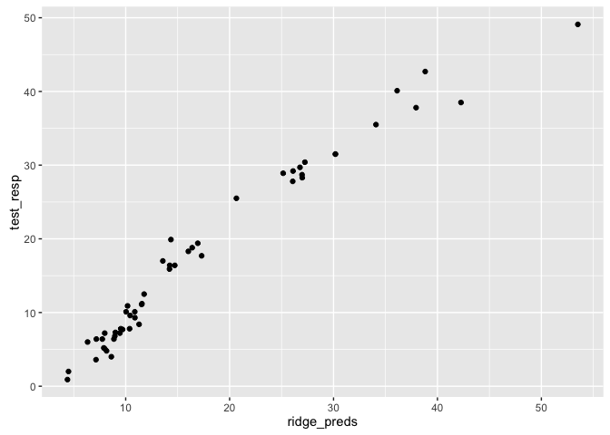
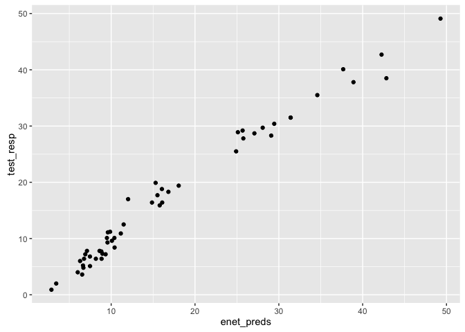
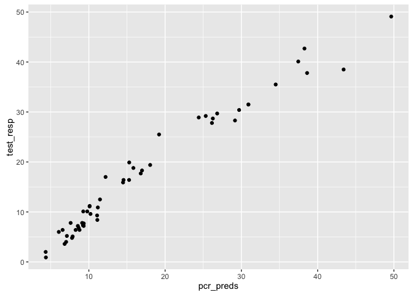
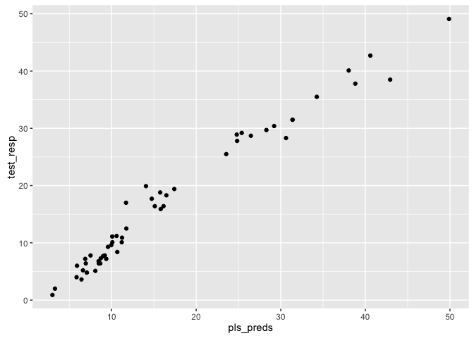
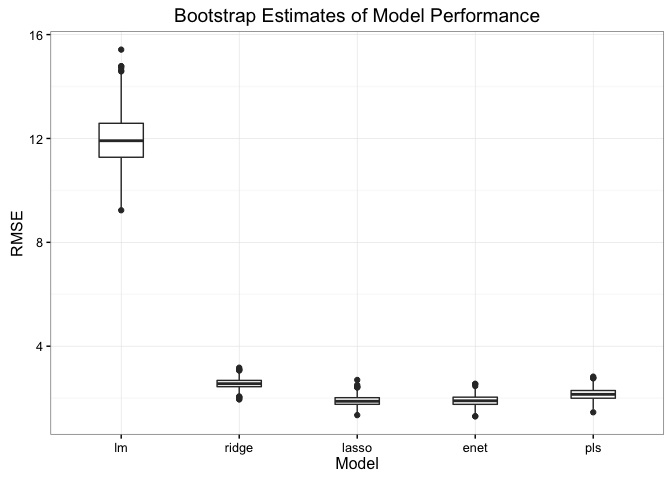

# Ex6.1 - Linear regression: IR spectrum of food
Oisin Fitzgerald  
26 January 2016  
### The data:
The data provides an infrared (IR) profile and analytical chemistry determined 
percent content of water, fat, and protein for meat samples. If there can be establish 
a predictive relationship between IR spectrum and fat content, then food scientists 
could predict a sample’s fat content with IR instead of using analytical chemistry

### Outline:
1. What is the relationship between the predictors? Are they highly correlated given 
the same food sample is measured at many IR wavelengths?
2. Create training/test split
3. Fit different models
  + Linear regression
  + Ridge regression, lasso and elastic net
  + PCR and PLS
4. Compare models predictive ability


```r
# load data and packages
library(car)
library(lars)
```

```
## Loaded lars 1.2
```

```r
library(broom)
library(reshape2)
suppressMessages(library(elasticnet))
suppressMessages(library(pls))
suppressMessages(library(caret))

data(tecator) # from caret
```

### 1. Relationship between predictors and distributions 


```r
# correlation
XX <- cor(absorp)
XX[1:5, 1:5]  # everything is related to everything!
```

```
##           [,1]      [,2]      [,3]      [,4]      [,5]
## [1,] 1.0000000 0.9999908 0.9999649 0.9999243 0.9998715
## [2,] 0.9999908 1.0000000 0.9999916 0.9999678 0.9999309
## [3,] 0.9999649 0.9999916 1.0000000 0.9999923 0.9999707
## [4,] 0.9999243 0.9999678 0.9999923 1.0000000 0.9999930
## [5,] 0.9998715 0.9999309 0.9999707 0.9999930 1.0000000
```

```r
# PCA
pca_object <- prcomp(absorp)
percent_variance <- pca_object$sdev^2/sum(pca_object$sd^2)*100
head(percent_variance)
```

```
## [1] 98.679162750  0.900926147  0.296292185  0.114005307  0.005754017
## [6]  0.002516023
```

```r
# Predictor distributions
ggplot(data = data.frame(absorp)) + 
  geom_histogram(aes(x = X1), bins = 20, col = 1) +
  labs(title = "Histogram of IR wavelength no. 1",
    x = "Wavelength predictor 1")  # positive skew
```

\

### 2. Create a training/test split

* 75% of the data to the training set
* The predictor variables show positive skew which Yeo-Johnson estimated lambda
(of -1 i.e. reciprocal) altered


```r
length(endpoints[ ,1])  # how many observations?
```

```
## [1] 215
```

```r
# create partition index
data_split <- createDataPartition(endpoints[ ,1], p = .75)
data_split <- data_split$Resample1

# split data
training <- absorp[data_split, ]
test <- absorp[-data_split, ]
train_resp <- endpoints[data_split, 2]  # column 2 is fat content
test_resp <- endpoints[-data_split, 2]

# de-skew variables
training <- data.frame(training)
test <- data.frame(test)
proc_object <- preProcess(training, 
  method = c("YeoJohnson", "center", "scale"))
training <- predict(proc_object, training)
test <- predict(proc_object, test)
```

### 3. Model fitting
* Linear regression  
    + Unsurprisingly prior removing of highly correlated predictors resulted in a model
    with only one independent variable. The performance on cross-validation was poor.
* Ridge regression
    + The ridge model quickly highlighted the ability to improve on the linear regression
    model. However, subsequent fitting of a lasso model showed that an ability to drive
    the coefficients to zero was an advantage in the highly correlated predictor environment.
* The lasso and elastic net
    + As noted the lasso model outperformed the ridge model. The optimal solution resulted
    in a large number of the coefficient being shrunk to zero
    + Enet performed similar to the lasso, with the best performing model having a
    low lambda for the ridge function  
* Principal components and partial least squares regression
    + These both performed quite well. The similarity of the PCR model to the PLS
    models is likely related to the variance in the predictors (IR response) very much 
    being a consequence of the variance in the response (food fat content), thus the 
    unsupervised nature of PCA causing little detriment.
    + The number of principal components was tuned rather than using the first two,
    or fist few that explained 90% of variance etc.


```r
ctrl <- trainControl(method = "cv", number = 5, repeats = 5)
# Linear regression
mc <- findCorrelation(training, cutoff = 0.95)
training_linear <- data.frame(training[ ,-mc])
# colnames(training_linear) <- "X1"
linear_model <- train(y = train_resp,
  x = training_linear,
  method = "lm",
  trControl = ctrl)
linear_model
```

```
## Linear Regression 
## 
## 163 samples
##  18 predictor
## 
## No pre-processing
## Resampling: Cross-Validated (5 fold) 
## Summary of sample sizes: 131, 131, 130, 129, 131 
## Resampling results
## 
##   RMSE      Rsquared   RMSE SD    Rsquared SD
##   2.463749  0.9598019  0.5468199  0.01877194 
## 
## 
```

```r
# Ridge Regression - penalise square of coefficient
ridge_model <- train(y = train_resp,
  x = training,
  method = "ridge",
  trControl = ctrl,
  tuneLength = 10)
ridge_model
```

```
## Ridge Regression 
## 
## 163 samples
## 100 predictors
## 
## No pre-processing
## Resampling: Cross-Validated (5 fold) 
## Summary of sample sizes: 131, 131, 131, 130, 129 
## Resampling results across tuning parameters:
## 
##   lambda        RMSE      Rsquared   RMSE SD    Rsquared SD
##   0.0000000000  3.739994  0.9119283  0.6066684  0.028597803
##   0.0001000000  2.629873  0.9578282  0.2248336  0.006184386
##   0.0002371374  2.757391  0.9531612  0.2228996  0.007462386
##   0.0005623413  2.845905  0.9496715  0.2116318  0.008515350
##   0.0013335214  2.929242  0.9462729  0.2067412  0.010149144
##   0.0031622777  3.097153  0.9395144  0.2453322  0.014306433
##   0.0074989421  3.459726  0.9240639  0.3541803  0.023381991
##   0.0177827941  3.993045  0.8987086  0.4894325  0.036862571
##   0.0421696503  4.607857  0.8662201  0.6188467  0.053116332
##   0.1000000000  5.414257  0.8148385  0.7583973  0.074649376
## 
## RMSE was used to select the optimal model using  the smallest value.
## The final value used for the model was lambda = 1e-04.
```

```r
plot(ridge_model)
```

\

```r
# Lasso - penalise absolute value of coeffienct
lasso_grid <- expand.grid(.fraction = seq(0.001, 0.1, 0.01))
lasso_model <- train(y = train_resp,
  x = training,
  method = "lasso",
  trControl = ctrl,
  tuneGrid = lasso_grid)
lasso_model
```

```
## The lasso 
## 
## 163 samples
## 100 predictors
## 
## No pre-processing
## Resampling: Cross-Validated (5 fold) 
## Summary of sample sizes: 131, 130, 130, 130, 131 
## Resampling results across tuning parameters:
## 
##   fraction  RMSE      Rsquared   RMSE SD    Rsquared SD
##   0.001     2.498027  0.9586242  0.5517407  0.016702083
##   0.011     1.706257  0.9809880  0.4545091  0.007295174
##   0.021     1.616745  0.9828973  0.4571834  0.007445864
##   0.031     1.641162  0.9822315  0.4325699  0.007161921
##   0.041     1.690999  0.9809893  0.4493865  0.008285186
##   0.051     1.745590  0.9795241  0.4873115  0.009721832
##   0.061     1.812704  0.9777559  0.5213582  0.011084715
##   0.071     1.880056  0.9759682  0.5502445  0.012306083
##   0.081     1.949916  0.9740845  0.5786471  0.013559222
##   0.091     2.013504  0.9724054  0.5906854  0.014314542
## 
## RMSE was used to select the optimal model using  the smallest value.
## The final value used for the model was fraction = 0.021.
```

```r
plot(lasso_model)
```

\

```r
# Elastic Net - combination of ridge and lasso
enet_grid <- expand.grid(.fraction = seq(0.001, 0.1, 0.01), .lambda = c(0, 0.0001, 0.001, 0.01))
enet_model <- train(y = train_resp,
  x = training,
  method = "enet",
  trControl = ctrl,
  tuneGrid = enet_grid)
enet_model
```

```
## Elasticnet 
## 
## 163 samples
## 100 predictors
## 
## No pre-processing
## Resampling: Cross-Validated (5 fold) 
## Summary of sample sizes: 131, 130, 130, 131, 130 
## Resampling results across tuning parameters:
## 
##   lambda  fraction  RMSE       Rsquared   RMSE SD    Rsquared SD
##   0e+00   0.001      2.456576  0.9577158  0.2733749  0.011822745
##   0e+00   0.011      1.625075  0.9823436  0.3002864  0.004490752
##   0e+00   0.021      1.542594  0.9840462  0.3650790  0.005845262
##   0e+00   0.031      1.587296  0.9828909  0.4460547  0.008348075
##   0e+00   0.041      1.597265  0.9825894  0.4840485  0.009325435
##   0e+00   0.051      1.634045  0.9816044  0.5281381  0.010634739
##   0e+00   0.061      1.700641  0.9799644  0.5649473  0.011780352
##   0e+00   0.071      1.767640  0.9783395  0.5926034  0.012665845
##   0e+00   0.081      1.824923  0.9770237  0.5923753  0.012675485
##   0e+00   0.091      1.883738  0.9755821  0.5988473  0.013059291
##   1e-04   0.001     11.596061  0.3239978  1.1803964  0.096503222
##   1e-04   0.011      9.927933  0.3579037  1.3335128  0.112225044
##   1e-04   0.021      9.356587  0.4486944  1.2675170  0.129496136
##   1e-04   0.031      8.798182  0.5326704  1.2055201  0.139155795
##   1e-04   0.041      8.252979  0.6063615  1.1468485  0.140999618
##   1e-04   0.051      7.725916  0.6679715  1.0930366  0.136610017
##   1e-04   0.061      7.216946  0.7182172  1.0439252  0.128483466
##   1e-04   0.071      6.731303  0.7581199  1.0003492  0.118015584
##   1e-04   0.081      6.276621  0.7886260  0.9627171  0.106885189
##   1e-04   0.091      5.856909  0.8118695  0.9291989  0.096011467
##   1e-03   0.001     11.829583  0.3244982  1.1872087  0.095754537
##   1e-03   0.011     10.485965  0.3258426  1.2318222  0.096750294
##   1e-03   0.021     10.055309  0.3374139  1.3522166  0.105781522
##   1e-03   0.031      9.814328  0.3759592  1.3257997  0.113461485
##   1e-03   0.041      9.575285  0.4142052  1.2999088  0.120175687
##   1e-03   0.051      9.338072  0.4517076  1.2740945  0.125751839
##   1e-03   0.061      9.103097  0.4880241  1.2482033  0.130111816
##   1e-03   0.071      8.871446  0.5226429  1.2223026  0.133169835
##   1e-03   0.081      8.642478  0.5554473  1.1968951  0.134970623
##   1e-03   0.091      8.416020  0.5863351  1.1717988  0.135674594
##   1e-02   0.001     11.899480  0.3246449  1.1857761  0.095527559
##   1e-02   0.011     10.983045  0.3247104  1.1955365  0.096268084
##   1e-02   0.021     10.357981  0.3259192  1.2344795  0.097581761
##   1e-02   0.031     10.083140  0.3294455  1.3325124  0.101116372
##   1e-02   0.041      9.970072  0.3504728  1.3452981  0.107880681
##   1e-02   0.051      9.827450  0.3731767  1.3282255  0.112164220
##   1e-02   0.061      9.685545  0.3957958  1.3113342  0.116141469
##   1e-02   0.071      9.544374  0.4182280  1.2944268  0.119774964
##   1e-02   0.081      9.404137  0.4403542  1.2778098  0.123037552
##   1e-02   0.091      9.264591  0.4621313  1.2612852  0.125902998
## 
## RMSE was used to select the optimal model using  the smallest value.
## The final values used for the model were fraction = 0.021 and lambda = 0.
```

```r
plot(enet_model)
```

\

```r
# PCR - 
pcr_results <- list(results = data.frame(RMSE = NA, RMSE_sd = NA), final = NA)
for (i in 1:20) {
  # fit model
  train_data <- princomp(training)$scores[ ,1:i]
  train_data <- data.frame(train_data)
  pcr_model <- train(y = train_resp,
  x = train_data,
  method = "lm",
  trControl = ctrl)
  
  # extract results
  pcr_results$results[i, 1] <- pcr_model$results$RMSE
  pcr_results$results[i, 2] <- pcr_model$results$RMSESD
  
  # extract model
  if (all(pcr_model$results$RMSE <= pcr_results$results$RMSE)) {
    pcr_results$final <- pcr_model
    }
}
pcr_results
```

```
## $results
##         RMSE   RMSE_sd
## 1  10.492353 1.0992732
## 2  10.068703 1.4639494
## 3   7.348469 0.3565198
## 4   4.853879 0.8780493
## 5   2.985895 0.3555118
## 6   2.920385 0.8442764
## 7   2.974529 0.5519718
## 8   3.008025 0.3828759
## 9   2.762710 0.1345710
## 10  2.656554 0.5481411
## 11  2.443768 0.4993940
## 12  2.448595 0.3380642
## 13  2.313984 0.6340779
## 14  2.073892 0.1928407
## 15  1.955401 0.1913254
## 16  1.998280 0.4672237
## 17  1.985154 0.4377664
## 18  1.721687 0.3300310
## 19  1.755865 0.3875057
## 20  1.849941 0.3611754
## 
## $final
## Linear Regression 
## 
## 163 samples
##  18 predictor
## 
## No pre-processing
## Resampling: Cross-Validated (5 fold) 
## Summary of sample sizes: 130, 131, 130, 131, 130 
## Resampling results
## 
##   RMSE      Rsquared   RMSE SD   Rsquared SD
##   1.721687  0.9800546  0.330031  0.004523028
## 
## 
```

```r
# PLS
pls_grid <- expand.grid(.ncomp = seq(10, 20, 1))
pls_model <- train(y = train_resp,
  x = training,
  method = "pls",
  trControl = ctrl,
  preProcess = c("center", "scale"),
  tuneGrid = pls_grid)
pls_model
```

```
## Partial Least Squares 
## 
## 163 samples
## 100 predictors
## 
## Pre-processing: centered (100), scaled (100) 
## Resampling: Cross-Validated (5 fold) 
## Summary of sample sizes: 130, 131, 131, 129, 131 
## Resampling results across tuning parameters:
## 
##   ncomp  RMSE      Rsquared   RMSE SD    Rsquared SD
##   10     2.198022  0.9652696  0.4323613  0.013561087
##   11     2.077700  0.9686279  0.2833400  0.012102779
##   12     1.941817  0.9743164  0.2371756  0.005813342
##   13     1.756872  0.9799257  0.4054312  0.005654873
##   14     1.565419  0.9838826  0.4455804  0.005821119
##   15     1.519931  0.9849073  0.3392128  0.003558747
##   16     1.500339  0.9853390  0.3783697  0.003795604
##   17     1.541301  0.9843025  0.3130718  0.002964976
##   18     1.521648  0.9846310  0.2903265  0.002670155
##   19     1.539470  0.9845291  0.2975242  0.002202640
##   20     1.612049  0.9828719  0.3038365  0.002147520
## 
## RMSE was used to select the optimal model using  the smallest value.
## The final value used for the model was ncomp = 16.
```

### 4. Compare performance on test set
* The results from fitting on the test set followed from the cross-validation 
included in model fitting. Linear regression did very poorly with ridge regression 
slightly worse off than the group of lasso, elastic net, PCR and PLS. 
* In context the RMSE and correlation between predicted and observed results are 
superb, and surely suggest that any of these models could be used in measuring the
fat content of food using infrared.
* Given the similarities in the model performances I was interested in constructing
confidence intervals around the RMSE. A function to calculate bootstrap 
estimation and its results are shown below.


```r
# Linear regression
test_linear <- data.frame(test[ ,-mc])
colnames(test_linear) <- colnames(training_linear)
linear_pred <- predict(linear_model, test_linear)
ggplot() + geom_point(aes(x = linear_pred, y = test_resp))
```

\

```r
n <- length(test_resp)
RMSE_lm <- sqrt(sum((test_resp - linear_pred)^2)/n); RMSE_lm
```

```
## [1] 2.474259
```

```r
# Ridge regression
ridge_preds <- predict(ridge_model, test)
ggplot() + geom_point(aes(x = ridge_preds, y = test_resp))
```

\

```r
RMSE_ridge <- sqrt(sum((test_resp - ridge_preds)^2)/n); RMSE_ridge
```

```
## [1] 3.214482
```

```r
# Lasso
lasso_preds <- predict(lasso_model, test)
ggplot() + geom_point(aes(x = lasso_preds, y = test_resp))
```

\

```r
RMSE_lasso <- sqrt(sum((test_resp - lasso_preds)^2)/n); RMSE_lasso
```

```
## [1] 1.638846
```

```r
# Elastic net
enet_preds <- predict(enet_model, test)
ggplot() + geom_point(aes(x = enet_preds, y = test_resp))
```

\

```r
RMSE_enet <- sqrt(sum((test_resp - enet_preds)^2)/n); RMSE_enet
```

```
## [1] 1.638846
```

```r
# PCR
pca_train <- princomp(training)
test_pcs <- predict(pca_train, test)
pcr_preds <- predict(pcr_results$final, test_pcs)
ggplot() + geom_point(aes(x = pcr_preds, y = test_resp))
```

\

```r
RMSE_pcr <- sqrt(sum((test_resp - pcr_preds)^2)/n); RMSE_pcr
```

```
## [1] 1.934021
```

```r
# PLS
pls_preds <- predict(pls_model, test)
ggplot() + geom_point(aes(x = pls_preds, y = test_resp))
```

\

```r
RMSE_pls <- sqrt(sum((test_resp - pls_preds)^2)/n); RMSE_pls
```

```
## [1] 1.69883
```

```r
cor(pls_preds, test_resp)
```

```
## [1] 0.993344
```

### 4. Compare performance on test set contd. 
* Bootstrap estimate of RMSE confidence interval
    + PLS appears to be the prefered model, it shows the least variation in its RMSE scores
    across the bootstrap samples. PCR is likely similar, an issue with variable naming meant
    I excluded it.


```r
boostrap_RMSE <- function(model, data, obs, trials = 1000, CI = 0.95) {
  
  n <- nrow(data)
  out <- list(results = data.frame(RMSE = NA), lower = NA, upper = NA)
  
  for (i in 1:trials) {
    # create bootstrap sample
    samp <- sample(n, size = n, replace = TRUE)
    boot_obs <- obs[samp]
    boot_data <- data.frame(data[samp, ])
    colnames(boot_data) <- colnames(data)
    # predict
    preds <- predict(model, newdata = boot_data)
    RMSE <- sqrt(sum((boot_obs - preds)^2)/n)
    
    out$results[i ,1] <- RMSE
  }
  
  temp <- out$results$RMSE
  temp <- quantile(temp, probs = c(0.025, 0.975), na.rm = TRUE)
  
  out$lower <- temp[1]
  out$upper <- temp[2]
  
  out
}
```


```r
# The bootstrap results
bRMSE_lm <- boostrap_RMSE(linear_model, test_linear, test_resp)
bRMSE_ridge <- boostrap_RMSE(ridge_model, test, test_resp)
bRMSE_lasso <- boostrap_RMSE(lasso_model, test, test_resp)
bRMSE_enet <- boostrap_RMSE(enet_model, test, test_resp)
# bRMSE_pcr <- boostrap_RMSE(pcr_model, test, test_resp)
bRMSE_pls <- boostrap_RMSE(pls_model, test, test_resp)

model_results <- data.frame(bRMSE_lm$results, bRMSE_ridge$results,
  bRMSE_lasso$results, bRMSE_enet$results, bRMSE_pls$results)
colnames(model_results) <- c('lm', 'ridge', 'lasso', 'enet', 'pls')

temp <- melt(model_results)
```

```
## No id variables; using all as measure variables
```

```r
ggplot(data = temp, aes(x = variable, y = value)) + 
  geom_boxplot(width = 0.5) + 
  theme_bw() + 
  labs(title = 'Bootstrap Estimates of Model Performance',
    x = 'Model',
    y = 'RMSE')
```

\

### Conclusion

* The clear signal in the data meant that despite multicollinarity issues several 
linear model fitting methods had no problem producing extremely predictive models. 
* The predictors were highly correlated and likely possessed variations on same 
information. Therefore possibly as a result of their ability to extract the minimal 
dimension signal from several correlated variables PCR and PLS appear to have a slight 
performance advantage over other models.
