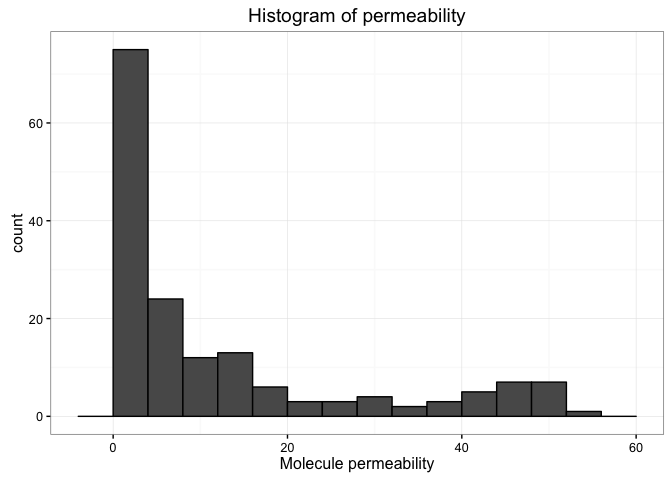
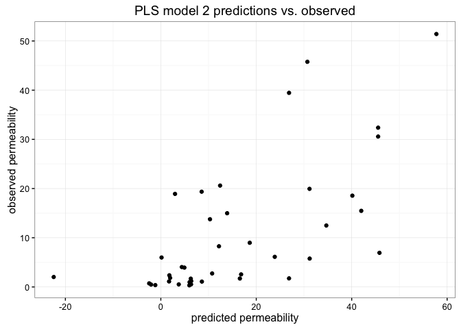
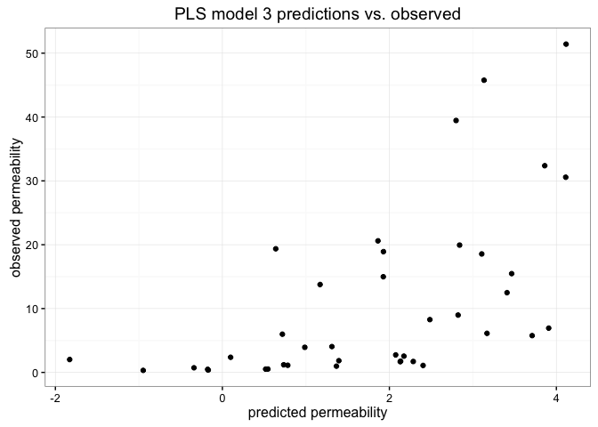
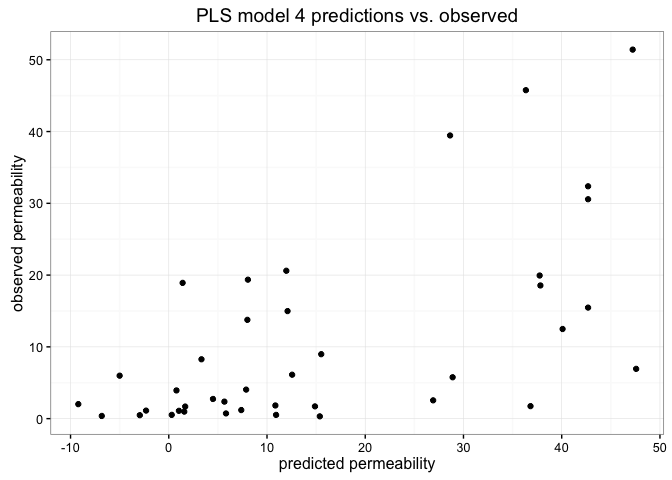
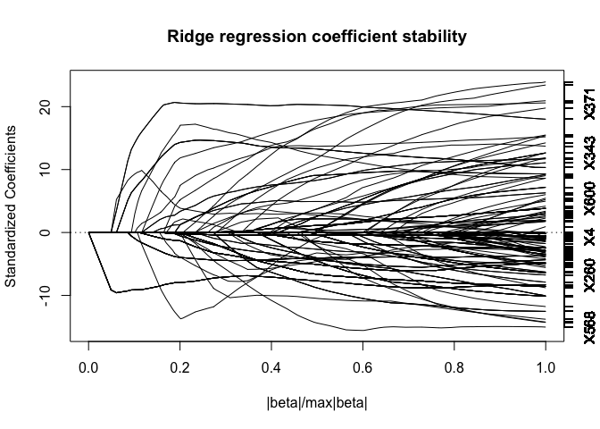

# Ex6.2 - Linear regression: molecule permeability
Oisin Fitzgerald  
27 January 2016  

### The data 

This pharmaceutical data set was used to develop a model for predicting compounds' 
permeability, a measure of a molecule's ability to cross a membrane. Permeability
impacts on a potential drug's usefulness, i.e. it needs to be able to cross
certain membranes to be effective. There exist assays to measure a compund's
permeability. The gaol here is to develop a predictive model for permeability 
in an attempt to potentially reduce the need for the assay. 
(brief description, more on ?permeability)

### Outline

* Training/test split
* Pre-process the data
    + Skewness of response
    + Sparseness
* Fit and test PLS models
* Fit and ridge regression, LASSO and elastic net models


```r
# Load data and packages
library(AppliedPredictiveModeling)
data(permeability)

suppressMessages(library(caret))
suppressMessages(library(pls))
suppressMessages(library(elasticnet))
suppressMessages(library(lars))
```

### Data splitting and pre-processing


```r
fingerprints <- data.frame(fingerprints)
permeability <- as.vector(permeability)
# Create training/test split index
Split <- createDataPartition(permeability, times = 1, p = 0.75)
Split <- Split$Resample1 
# Create training and test splits
training <- fingerprints[Split, ]
test <- fingerprints[-Split, ]
response_train <- permeability[Split]
response_test <- permeability[-Split]

# Pre-processing
training_filter <- training[ ,-nearZeroVar(training, freqCut = 95/5)]  # near zero variances
# binary data...

# positively skewed
ggplot() + geom_histogram(aes(x = permeability), binwidth = 4, col = 1) + 
  labs(title = "Histogram of permeability", x = "Molecule permeability") +
  theme_bw()
```

\

```r
preProcess(data.frame(permeability), method = c("YeoJohnson"))
```

```
## Created from 165 samples and 1 variables
## 
## Pre-processing:
##   - ignored (0)
##   - Yeo-Johnson transformation (1)
## 
## Lambda estimates for Yeo-Johnson transformation:
## -0.19
```

### Fit and test partial least squares models

Three variations on a PLS model were fit and tested:
1. A model fit to the full training set
2. A model fit to the near zero variance reduced training set
3. A model fit to a log transformed response

None of the models created appear to have the predictive ability to replace the 
mentioned assay method, they lack accurate predictive ability. The log(response)
PLS model (and others) appears to shown promise within a certain range. Possibly 
the current linear technique is too restrictive. Some models are producing negative 
predictions - multicolinearity?. 


```r
# Fit PLS models
ctrl = trainControl("repeatedcv", number = 5, repeats = 5)
pls_model.1 <- train(y = response_train,
  x = training,
  method = "pls",
  metric = "Rsquared",
  tuneLength = 10,
  trControl = ctrl)
pls_model.1
```

```
## Partial Least Squares 
## 
##  125 samples
## 1107 predictors
## 
## No pre-processing
## Resampling: Cross-Validated (5 fold, repeated 5 times) 
## Summary of sample sizes: 101, 100, 100, 100, 99, 99, ... 
## Resampling results across tuning parameters:
## 
##   ncomp  RMSE      Rsquared   RMSE SD   Rsquared SD
##    1     14.12589  0.2801179  2.015635  0.1594071  
##    2     12.41503  0.4325951  2.089575  0.1719383  
##    3     11.86396  0.4798535  2.175933  0.1709627  
##    4     11.95253  0.4829617  2.599663  0.1876928  
##    5     11.90959  0.4916929  2.613462  0.1848358  
##    6     12.00479  0.4855347  2.450659  0.1790584  
##    7     11.99263  0.4870670  2.462163  0.1834921  
##    8     12.24073  0.4756755  2.435113  0.1808482  
##    9     12.62208  0.4533456  2.255274  0.1705803  
##   10     12.89147  0.4352161  2.126619  0.1643402  
## 
## Rsquared was used to select the optimal model using  the largest value.
## The final value used for the model was ncomp = 5.
```

```r
pls_model.2 <- train(y = response_train,
  x = training_filter,
  method = "pls",
  metric = "Rsquared",
  tuneLength = 10,
  trControl = ctrl)
pls_model.2
```

```
## Partial Least Squares 
## 
## 125 samples
## 370 predictors
## 
## No pre-processing
## Resampling: Cross-Validated (5 fold, repeated 5 times) 
## Summary of sample sizes: 101, 101, 100, 98, 100, 101, ... 
## Resampling results across tuning parameters:
## 
##   ncomp  RMSE      Rsquared   RMSE SD   Rsquared SD
##    1     14.13641  0.2874455  1.994562  0.16353002 
##    2     12.45425  0.4515863  2.294324  0.18511199 
##    3     12.02477  0.4866895  1.819542  0.15405348 
##    4     11.90942  0.5012018  1.518869  0.12878618 
##    5     11.49920  0.5388000  1.636276  0.12788898 
##    6     11.22734  0.5560475  1.573719  0.12308173 
##    7     10.98385  0.5743623  1.597932  0.11307569 
##    8     10.93646  0.5835801  1.423035  0.10149986 
##    9     11.27032  0.5639006  1.400459  0.09743804 
##   10     11.71468  0.5353356  1.389022  0.10426772 
## 
## Rsquared was used to select the optimal model using  the largest value.
## The final value used for the model was ncomp = 8.
```

```r
pls_model.3 <- train(y = log(response_train),
  x = training,
  method = "pls",
  metric = "Rsquared",
  tuneLength = 10,
  trControl = ctrl)
pls_model.3
```

```
## Partial Least Squares 
## 
##  125 samples
## 1107 predictors
## 
## No pre-processing
## Resampling: Cross-Validated (5 fold, repeated 5 times) 
## Summary of sample sizes: 100, 100, 99, 101, 100, 100, ... 
## Resampling results across tuning parameters:
## 
##   ncomp  RMSE      Rsquared   RMSE SD    Rsquared SD
##    1     1.394441  0.2209422  0.2093430  0.15466007 
##    2     1.263407  0.3538704  0.1414747  0.10271977 
##    3     1.184729  0.4310581  0.1491980  0.11057008 
##    4     1.146549  0.4644069  0.1344120  0.10952157 
##    5     1.129306  0.4825250  0.1235525  0.10382922 
##    6     1.105925  0.5051179  0.1484921  0.11964499 
##    7     1.088086  0.5202448  0.1387113  0.10900261 
##    8     1.058015  0.5470990  0.1483578  0.10895902 
##    9     1.049602  0.5577494  0.1392980  0.09936161 
##   10     1.062223  0.5519139  0.1482355  0.10572280 
## 
## Rsquared was used to select the optimal model using  the largest value.
## The final value used for the model was ncomp = 9.
```

```r
# post hoc: remove multicollinearity and refit
remove <- findLinearCombos(training_filter)
training_filter2 <- training_filter[ ,remove$remove]

pls_model.4 <- train(y = response_train,
  x = training_filter2,
  method = "pls",
  metric = "Rsquared",
  tuneLength = 10,
  trControl = ctrl)
pls_model.4
```

```
## Partial Least Squares 
## 
## 125 samples
## 277 predictors
## 
## No pre-processing
## Resampling: Cross-Validated (5 fold, repeated 5 times) 
## Summary of sample sizes: 99, 100, 100, 100, 101, 100, ... 
## Resampling results across tuning parameters:
## 
##   ncomp  RMSE      Rsquared   RMSE SD   Rsquared SD
##    1     14.54842  0.2293263  1.877668  0.1760119  
##    2     12.80386  0.3991476  2.272226  0.1871358  
##    3     12.70781  0.4169945  1.743083  0.1609883  
##    4     12.63029  0.4255008  1.957180  0.1622419  
##    5     12.70340  0.4287808  2.043817  0.1557772  
##    6     12.59538  0.4455729  2.083568  0.1491574  
##    7     12.70171  0.4411228  2.268840  0.1523978  
##    8     12.85886  0.4320981  2.066638  0.1363235  
##    9     12.98160  0.4296388  2.023933  0.1315781  
##   10     13.29837  0.4131454  2.074848  0.1305968  
## 
## Rsquared was used to select the optimal model using  the largest value.
## The final value used for the model was ncomp = 6.
```

```r
# Predict on test data
pls1_preds <- predict(pls_model.1, test)
RMSE(pls1_preds, response_test)
```

```
## [1] 14.74978
```

```r
cor(pls1_preds, response_test)^2  # Rsquared
```

```
## [1] 0.3746941
```

```r
ggplot() + 
  geom_point(aes(x = pls1_preds, y = response_test)) + 
  theme_bw() +
  labs(title = "PLS model 1 predictions vs. observed", 
    x = "predicted permeability", 
    y = "observed permeability")
```

\

```r
pls2_preds <- predict(pls_model.2, test)
RMSE(pls2_preds, response_test)
```

```
## [1] 13.8051
```

```r
cor(pls2_preds, response_test)^2  # Rsquared
```

```
## [1] 0.4424359
```

```r
ggplot() + 
  geom_point(aes(x = pls2_preds, y = response_test)) + 
  theme_bw() +
  labs(title = "PLS model 2 predictions vs. observed", 
    x = "predicted permeability", 
    y = "observed permeability")
```

\

```r
pls3_preds <- predict(pls_model.3, test)
RMSE(exp(pls3_preds), response_test)
```

```
## [1] 13.75083
```

```r
cor(exp(pls3_preds), response_test)^2  # Rsquared
```

```
## [1] 0.3905663
```

```r
ggplot() + 
  geom_point(aes(x = pls3_preds, y = response_test)) + 
  theme_bw() +
  labs(title = "PLS model 3 predictions vs. observed", 
    x = "predicted permeability", 
    y = "observed permeability")
```

\

```r
# can it predict well within a certain range??
RMSE(exp(pls3_preds[response_test<20]), response_test[response_test<20])
```

```
## [1] 12.19276
```

```r
pls4_preds <- predict(pls_model.4, test)
RMSE(pls4_preds, response_test)
```

```
## [1] 14.45052
```

```r
cor(pls4_preds, response_test)^2  # Rsquared
```

```
## [1] 0.3826303
```

```r
ggplot() + 
  geom_point(aes(x = pls4_preds, y = response_test)) + 
  theme_bw() +
  labs(title = "PLS model 4 predictions vs. observed", 
    x = "predicted permeability", 
    y = "observed permeability")
```

\

#### Fit and ridge regression, LASSO and elastic net models

As with the PLS models, none of the models were stong predictors of the data, suggesting
that laboratory methods of measuring permeability are prefereable (at least) to the
models fitted. The PLS models actually outperformed the shrinkage methods. Further the 
cross validated estimates of RMSE and R2 were quite inaccurate compared to the test fits. 
There appears to be residual instability in the cofficients even in these shrinkage methods, 
with enet and ridge producing hugely negative predictions and RMSE before being tuned 
over a predefined range of shrinkage coefficients. 


```r
# Fit shrinkage models
ctrl <- trainControl("cv", number = 5)

ridge_grid <- expand.grid(.lambda = seq(0.05, 0.2, 0.01))
ridge_model <- train(y = response_train, 
  x = training_filter2,  # model fitting impacted by zero variance
  method = "ridge",
  tuneGrid = ridge_grid,
  metric = "RMSE",
  trControl = ctrl)
ridge_model
```

```
## Ridge Regression 
## 
## 125 samples
## 277 predictors
## 
## No pre-processing
## Resampling: Cross-Validated (5 fold) 
## Summary of sample sizes: 100, 100, 100, 99, 101 
## Resampling results across tuning parameters:
## 
##   lambda  RMSE      Rsquared   RMSE SD   Rsquared SD
##   0.05    14.26429  0.3469361  3.240907  0.1980152  
##   0.06    14.13896  0.3559712  3.218352  0.1956677  
##   0.07    14.04347  0.3635573  3.209867  0.1942977  
##   0.08    13.96978  0.3702479  3.205188  0.1934118  
##   0.09    13.90489  0.3761472  3.201440  0.1928339  
##   0.10    13.84637  0.3815359  3.198597  0.1925102  
##   0.11    13.81797  0.3856901  3.223695  0.1930815  
##   0.12    13.78728  0.3898212  3.235720  0.1934281  
##   0.13    13.76418  0.3935468  3.250413  0.1939387  
##   0.14    13.70465  0.3988747  3.194384  0.1925732  
##   0.15    13.72007  0.4007911  3.257135  0.1944723  
##   0.16    13.73433  0.4025027  3.312094  0.1964504  
##   0.17    13.65160  0.4088949  3.194072  0.1933448  
##   0.18    13.67577  0.4103241  3.253685  0.1952229  
##   0.19    13.63409  0.4146022  3.194897  0.1940248  
##   0.20    13.65158  0.4162339  3.233357  0.1954084  
## 
## RMSE was used to select the optimal model using  the smallest value.
## The final value used for the model was lambda = 0.19.
```

```r
# remaining instability in the coefficients?
plot(ridge_model$finalModel)
title(main = "Ridge regression coefficient stability")  
```

\

```r
lasso_model <- train(y = response_train, 
  x = training_filter2,  
  method = "lasso",
  tuneLength = 10,
  metric = "RMSE",
  trControl = ctrl)
lasso_model
```

```
## The lasso 
## 
## 125 samples
## 277 predictors
## 
## No pre-processing
## Resampling: Cross-Validated (5 fold) 
## Summary of sample sizes: 98, 101, 101, 99, 101 
## Resampling results across tuning parameters:
## 
##   fraction   RMSE        Rsquared   RMSE SD    Rsquared SD
##   0.1000000    9110.973  0.3242448   20342.54  0.2305155  
##   0.1888889   17103.552  0.3248907   38214.02  0.2576174  
##   0.2777778   33554.929  0.3315620   75000.16  0.2734539  
##   0.3666667   51774.847  0.3286516  115740.61  0.2690170  
##   0.4555556   70602.749  0.3143725  157840.22  0.2537059  
##   0.5444444   90321.095  0.3037186  201931.22  0.2403576  
##   0.6333333  110101.793  0.2976369  246161.76  0.2304663  
##   0.7222222  129916.309  0.2949451  290468.13  0.2229269  
##   0.8111111  149318.484  0.2870511  333852.23  0.2160301  
##   0.9000000  168562.774  0.2763813  376883.05  0.2062604  
## 
## RMSE was used to select the optimal model using  the smallest value.
## The final value used for the model was fraction = 0.1.
```

```r
enet_grid <- expand.grid(.lambda = c(0.01, 0.02, 0.03, 0.05), .fraction = c(seq(0.00001, 0.2, 0.02)))
enet_model <- train(y = response_train, 
  x = training_filter,
  method = "enet",
  tuneGrid = enet_grid,
  metric = "RMSE",
  trControl = ctrl)
enet_model
```

```
## Elasticnet 
## 
## 125 samples
## 370 predictors
## 
## No pre-processing
## Resampling: Cross-Validated (5 fold) 
## Summary of sample sizes: 101, 100, 100, 101, 98 
## Resampling results across tuning parameters:
## 
##   lambda  fraction  RMSE      Rsquared   RMSE SD    Rsquared SD
##   0.01    0.00001   16.20387  0.4104844  1.0182184  0.18272955 
##   0.01    0.02001   13.87268  0.4150714  1.0692719  0.16420088 
##   0.01    0.04001   12.78141  0.4175494  1.1372225  0.10885746 
##   0.01    0.06001   12.54578  0.4085081  1.1839283  0.09903446 
##   0.01    0.08001   12.33540  0.4236548  0.9795106  0.08453264 
##   0.01    0.10001   12.21048  0.4354692  0.8230406  0.07702949 
##   0.01    0.12001   12.11723  0.4458469  0.8213061  0.07598583 
##   0.01    0.14001   12.09290  0.4501368  0.8129704  0.07798469 
##   0.01    0.16001   12.05235  0.4565517  0.8165102  0.08163804 
##   0.01    0.18001   12.01800  0.4625189  0.8127518  0.08684807 
##   0.02    0.00001   16.20410  0.4104844  1.0182928  0.18272955 
##   0.02    0.02001   14.09418  0.4143868  1.0478786  0.16432456 
##   0.02    0.04001   12.89163  0.4246374  1.1253347  0.11811265 
##   0.02    0.06001   12.59891  0.4094209  1.1983122  0.10544503 
##   0.02    0.08001   12.44036  0.4151066  1.1398766  0.09682953 
##   0.02    0.10001   12.31475  0.4257743  0.9451951  0.08501402 
##   0.02    0.12001   12.19302  0.4375956  0.8355392  0.07922614 
##   0.02    0.14001   12.11181  0.4463517  0.8308710  0.07818994 
##   0.02    0.16001   12.08293  0.4507623  0.8141316  0.07903433 
##   0.02    0.18001   12.04035  0.4570083  0.8130894  0.08193302 
##   0.03    0.00001   16.20421  0.4104844  1.0182682  0.18272955 
##   0.03    0.02001   14.21115  0.4124214  1.0029421  0.16402693 
##   0.03    0.04001   12.99712  0.4234639  1.1658812  0.13583843 
##   0.03    0.06001   12.59611  0.4141328  1.1642766  0.10568952 
##   0.03    0.08001   12.50335  0.4100662  1.2201652  0.10547035 
##   0.03    0.10001   12.36856  0.4208988  1.1034849  0.09941567 
##   0.03    0.12001   12.25816  0.4310796  0.9459415  0.09120199 
##   0.03    0.14001   12.15817  0.4413571  0.8579290  0.08405673 
##   0.03    0.16001   12.07518  0.4499026  0.8397519  0.08414664 
##   0.03    0.18001   12.03730  0.4549964  0.8274005  0.08638877 
##   0.05    0.00001   16.20440  0.4104844  1.0183573  0.18272955 
##   0.05    0.02001   14.41209  0.4114486  1.0296163  0.16568131 
##   0.05    0.04001   13.23826  0.4232309  1.2315575  0.15481758 
##   0.05    0.06001   12.68330  0.4206394  1.1718478  0.11273411 
##   0.05    0.08001   12.52746  0.4113844  1.1777974  0.10429839 
##   0.05    0.10001   12.46332  0.4135083  1.2256036  0.10605972 
##   0.05    0.12001   12.39655  0.4192155  1.1207993  0.09901656 
##   0.05    0.14001   12.32335  0.4264486  0.9972745  0.09118388 
##   0.05    0.16001   12.22329  0.4367257  0.9115938  0.08424315 
##   0.05    0.18001   12.13832  0.4456274  0.8794157  0.08362259 
## 
## RMSE was used to select the optimal model using  the smallest value.
## The final values used for the model were fraction = 0.18001 and lambda
##  = 0.01.
```

```r
# Test shrinkage models
ridge_preds <- predict(ridge_model, test)
RMSE(ridge_preds, response_test)
```

```
## [1] 41.89106
```

```r
cor(ridge_preds, response_test)^2
```

```
## [1] 0.1116555
```

```r
lasso_preds <- predict(lasso_model, test)
RMSE(lasso_preds, response_test)
```

```
## [1] 2.368724e+15
```

```r
cor(lasso_preds, response_test)^2
```

```
## [1] 0.1439556
```

```r
enet_preds <- predict(enet_model, test)
RMSE(enet_preds, response_test)
```

```
## [1] 30.95827
```

```r
cor(enet_preds, response_test)^2
```

```
## [1] 0.2149163
```


