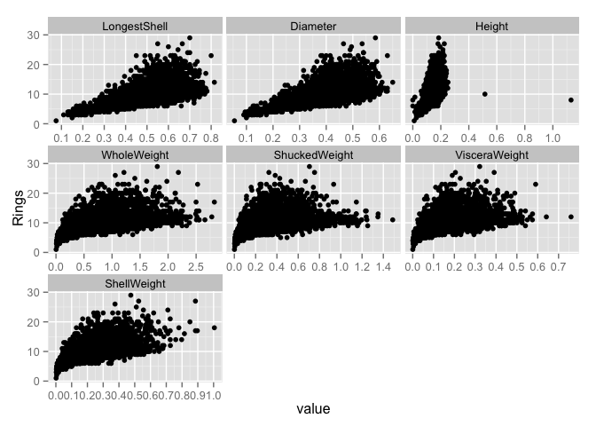
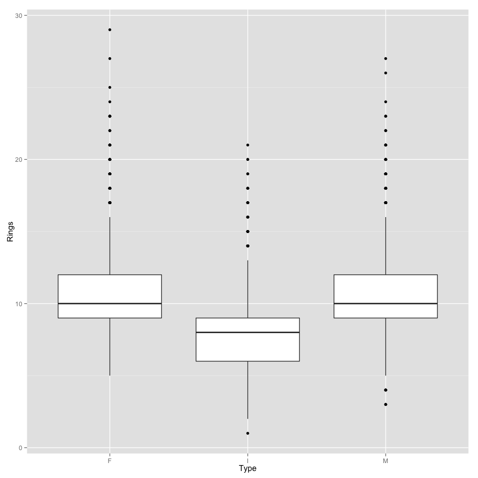
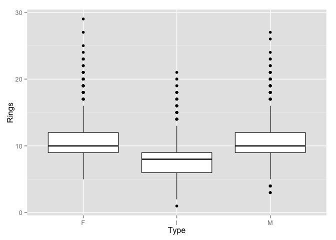

# Ex 18.3 Measuring predictor importance: abalone data set
Oisin Fitzgerald  
The UCI Abalone data (http://archive.ics.uci.edu/ml/datasets/Abalone)
consist of data from 4,177 abalones (sea snails). The data contain measurements 
of the type (male, female, and infant), the longest shell measurement, the diameter,
height, and several weights (whole, shucked, viscera, and shell). The outcome
is the number of rings.
This script:
1. Visualises how the predictors relate to the reponse 
2. Visualises how the predictors relate to each other
3. Evaluates predictor importance based on several methods
4. Filters redundant predictors and uses PCA to create a set of orthogonal predictors


```r
library(AppliedPredictiveModeling)
data(abalone)
str(abalone)
```

```
## 'data.frame':	4177 obs. of  9 variables:
##  $ Type         : Factor w/ 3 levels "F","I","M": 3 3 1 3 2 2 1 1 3 1 ...
##  $ LongestShell : num  0.455 0.35 0.53 0.44 0.33 0.425 0.53 0.545 0.475 0.55 ...
##  $ Diameter     : num  0.365 0.265 0.42 0.365 0.255 0.3 0.415 0.425 0.37 0.44 ...
##  $ Height       : num  0.095 0.09 0.135 0.125 0.08 0.095 0.15 0.125 0.125 0.15 ...
##  $ WholeWeight  : num  0.514 0.226 0.677 0.516 0.205 ...
##  $ ShuckedWeight: num  0.2245 0.0995 0.2565 0.2155 0.0895 ...
##  $ VisceraWeight: num  0.101 0.0485 0.1415 0.114 0.0395 ...
##  $ ShellWeight  : num  0.15 0.07 0.21 0.155 0.055 0.12 0.33 0.26 0.165 0.32 ...
##  $ Rings        : int  15 7 9 10 7 8 20 16 9 19 ...
```

```r
head(abalone)
```

```
##   Type LongestShell Diameter Height WholeWeight ShuckedWeight
## 1    M        0.455    0.365  0.095      0.5140        0.2245
## 2    M        0.350    0.265  0.090      0.2255        0.0995
## 3    F        0.530    0.420  0.135      0.6770        0.2565
## 4    M        0.440    0.365  0.125      0.5160        0.2155
## 5    I        0.330    0.255  0.080      0.2050        0.0895
## 6    I        0.425    0.300  0.095      0.3515        0.1410
##   VisceraWeight ShellWeight Rings
## 1        0.1010       0.150    15
## 2        0.0485       0.070     7
## 3        0.1415       0.210     9
## 4        0.1140       0.155    10
## 5        0.0395       0.055     7
## 6        0.0775       0.120     8
```

```r
library(ggplot2)
library(tidyr)
library(scales)
library(corrplot)
library(CORElearn)
library(car)
library(caret)
```

```
## Loading required package: lattice
```

```r
library(minerva)
```

### 1. How do the predictors relate to the number of rings?
Visually displaying the data shows some clear relationships and also outlying
values. In the plots of rings vs. the continouos variables there are both linear
(e.g. diameter) and non-linear (e.g. the weight variables) patterns. The similar 
shapes of some of the point clouds are suggestive that some of the variables likely 
contain the same information. Of course this makes sense given likely strong 
relationships between the various weight and length variables. Height shows two 
outlying points with values about 4 to 10 times greater than normal, suggesting
they may be incorrectly entered values. The boxplots show an expected pattern, 
with infants having less rings than adults.

```r
# format data for plotting
gg_data <- gather(abalone, Rings)
```

```
## Warning: attributes are not identical across measure variables; they will
## be dropped
```

```r
names(gg_data) <- c("Rings", "variable", "value")
gg_data <- subset(gg_data, gg_data$variable != "Type")
gg_data$value <- as.numeric(gg_data$value)
# scatter plots for continuous variables
ggplot(aes(x = value, y = Rings), data = gg_data) + 
  geom_point() +
  facet_wrap(~variable, scales = "free_x") +
  scale_x_continuous(breaks = pretty_breaks(n = 8)) 
```

 

```r
# boxplot for Type variable
ggplot(aes(x = Type, y = Rings), data = abalone) + 
  geom_boxplot()
```

 

### 2. How do the predictors relate to each other?
The car packages amazing function car::scatterplotMatrix

```r
X <- abalone[ , sapply(abalone, is.numeric) ]
X <- X[ ,-8]  # remove Rings

# matrix scatter plots
scatterplotMatrix(X, smoother = FALSE, reg.line = FALSE)
```

 

```r
# LOESS fit
loess_results <- filterVarImp(x = X, y = abalone$Rings, nonpara = TRUE)
```

```
## Loading required package: pROC
## Type 'citation("pROC")' for a citation.
## 
## Attaching package: 'pROC'
## 
## The following objects are masked from 'package:stats':
## 
##     cov, smooth, var
```

```r
loess_results
```

```
##                 Overall
## LongestShell  0.3099367
## Diameter      0.3302339
## Height        0.3107698
## WholeWeight   0.3454217
## ShuckedWeight 0.2691416
## VisceraWeight 0.3248622
## ShellWeight   0.4224143
```

```r
# correlations
XX <- cor(X)
corrplot(XX, "number", tl.cex = 0.7)
```

 

### 3. Predictor importance scores
A downside of all the measure used in this section is that they soley reveal bivariate
relationships. We cannot know for example if ther interaction of two predictors is 
an important term to include in any model. Regardless the various measures of linear, 
rank, and information provide a useful to gauge the likely importance of a variable in
improving the predictive ability of a model (i.e. screening!). 
Pearson's *r* provides a measure of the linear relationships between two variables
while Spearman's *rho* is the rank correlation between the variable and so is better
suited to picking up non-linear relationships. All variable have a greater Spearman's
*rho* than Pearson's *r* suggesting future model sshould take into account this non-linearity.
The ANOVA and pariwise t-tests confirm what the boxplot showed: that infants are 
most different from the other groups in number of rings.

```r
# linear correlations
pearsonsR <- apply(X, MARGIN = 2, FUN = cor, y = abalone$Rings, method = "pearson")
pearsonsR
```

```
##  LongestShell      Diameter        Height   WholeWeight ShuckedWeight 
##     0.5567196     0.5746599     0.5574673     0.5403897     0.4208837 
## VisceraWeight   ShellWeight 
##     0.5038192     0.6275740
```

```r
# rank correlations
spearmansRho <- apply(X, MARGIN = 2, FUN = cor, y = abalone$Rings, method = "spearman")
spearmansRho
```

```
##  LongestShell      Diameter        Height   WholeWeight ShuckedWeight 
##     0.6043853     0.6228950     0.6577164     0.6308320     0.5394200 
## VisceraWeight   ShellWeight 
##     0.6143438     0.6924746
```

```r
# ANOVA and t tests (Type variable)
anova(lm(Rings ~ Type, data = abalone)) 
```

```
## Analysis of Variance Table
## 
## Response: Rings
##             Df Sum Sq Mean Sq F value    Pr(>F)    
## Type         2   8381  4190.6  499.33 < 2.2e-16 ***
## Residuals 4174  35030     8.4                      
## ---
## Signif. codes:  0 '***' 0.001 '**' 0.01 '*' 0.05 '.' 0.1 ' ' 1
```

```r
pairwise.t.test(abalone$Rings, abalone$Type, pool.sd = FALSE)
```

```
## 
## 	Pairwise comparisons using t tests with non-pooled SD 
## 
## data:  abalone$Rings and abalone$Type 
## 
##   F       I      
## I < 2e-16 -      
## M 0.00025 < 2e-16
## 
## P value adjustment method: holm
```

The maximal information coefficient (MIC) is an information theory based measure
of the strength of linear and/or non-linear relationship between two variables. It
bins continuous variables in such a way as to maximise the mutual information, the
amount of information you gain about the likely value of one variable given the 
value of another. The results suggest that all variables are moderately related to 
thee number fo rings. MIC minus R^2 is suggested as a measure of the degree of 
non-linearity in the relationship, all values of this measure are close to zero 
implying non-linear relationships.

```r
# MIC
mic_values <- mine(x = X, y = abalone$Rings)
mic_values$MIC
```

```
##                       Y
## LongestShell  0.3546951
## Diameter      0.3652849
## Height        0.3449086
## WholeWeight   0.3539886
## ShuckedWeight 0.3153369
## VisceraWeight 0.3510614
## ShellWeight   0.3866459
```

The RReliefF algorithm is an adaption of ReliefF to a regression setting 
(Robnik-Šikonja & Kononenko, 1997). It is a measure of how likely nearby instances
of randomly selected observations are to give a similar prediction in the response.
It can be combined with a permutation test to give an indication of how much the
results differ from chance.

```r
#RreliefF (optimistic!!)
relief_values <- attrEval(abalone$Rings ~ ., data = X,
  estimator = "RReliefFbestK",  # calculation method
  ReliefIterations = 50)  # num iteration
relief_values <- data.frame(Predictor = names(relief_values), 
  value = relief_values, 
  row.names = NULL)

# RreliefF permutation test
relief_perm <- permuteRelief(x = X, y = abalone$Rings, nperm = 500,
  estimator = "RReliefFbestK",
  ReliefIterations = 50)

# standard deviations from permutation score distribution
relief_perm$standardized[order(relief_perm$standardized)]
```

```
##  LongestShell      Diameter ShuckedWeight   WholeWeight VisceraWeight 
##      7.739736      8.181680      8.212930     10.758419     12.407788 
##   ShellWeight        Height 
##     12.870966     17.491489
```

### 4. Filters redundant predictors and create a set of non-redundant Principal component analysis
Given the relationships between the variables this function filters out highly
correlated variable leaving a reduced set. It follows a heuristic algorithm in 
Kuhn and Johnson's book in removing from a pair that variable most related to the
other variables. PCA is then performed, with the first two principal components
accounting for 90% of the variance. The filter method at *r* = 0.75 also leads to
the conclusion there are only two non-redundant "pieces of information" in this data set.

```r
# Filter predictors
# returns name of predictors to keep, possibly still highly correlated if only
# two, in this case examine how they relate to the response in making decisions
filter_vars <- function(X, cor_level = 0.75,...) {
  XX <- cor(X)
  XX <- XX - diag(diag(XX))
  while (any(XX > cor_level)) {
        if (ncol(XX) <= 2) { # prevent entering filtering loop
          return(colnames(XX))
    } else {
      var_ind <- which(XX == max(XX), arr.ind = TRUE)
      var.1 <- row.names(var_ind)[1]
      var.2 <- row.names(var_ind)[2]
      var.1_av <- sum(XX[var.1, ])/(length(XX[var.1, ]) - 1)
      var.2_av <- sum(XX[var.2, ])/(length(XX[var.2, ]) - 1)
      if (var.1_av > var.2_av) {
        XX <- XX[!(row.names(XX) == var.1),!(colnames(XX) == var.1)]
        } else {
          XX <- XX[!(row.names(XX) == var.2),!(colnames(XX) == var.2)]
        }
    }
  }
  colnames(XX)
}

filter_vars(X)  # works...
```

```
## [1] "Height"        "ShuckedWeight"
```

```r
# PCA
pca_object <- prcomp(X, center = TRUE, scale. = TRUE)
percent_variance <- pca_object$sd^2/sum(pca_object$sd^2)*100
percent_variance # in agreement with filtering method that there are really 
```

```
## [1] 90.78731479  3.99189090  2.39063820  1.62959779  0.92362741  0.18182994
## [7]  0.09510098
```


