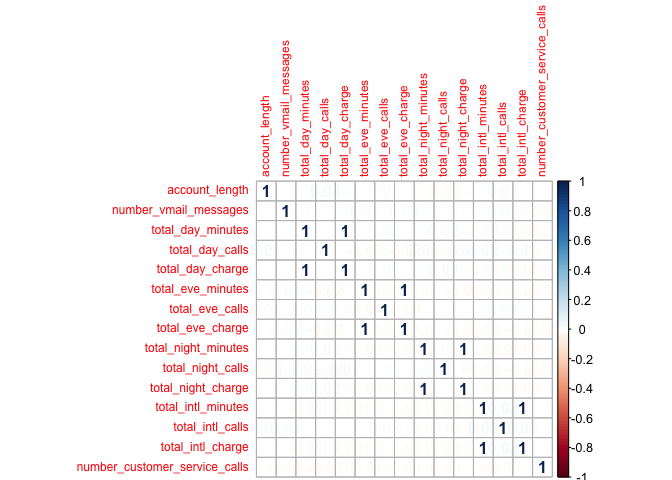
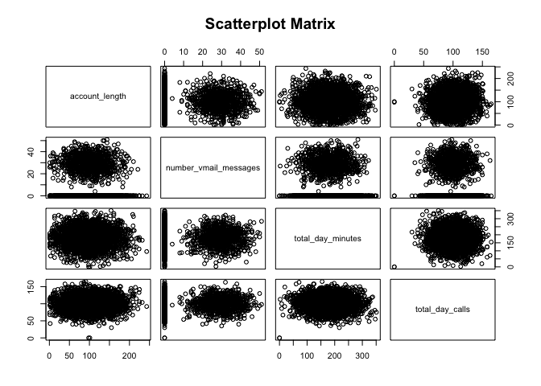

# Exercise 18.1 - Measuring predictor importance
Oisin Fitzgerald  

The “churn” data set was developed to predict telecom customer churn based on 
information about their account. It contains 20 variables, with the 19
predictors including continuous and factor variables that describe an individual
account. The response churn has two levels "yes" and "no". This script....

(a) Examining the correlation between predictors
------------------------------------------------

```r
# load packages
library(AppliedPredictiveModeling)
library(C50)
library(corrplot)
library(car)

# load data
data(churn)
str(churnTrain)
```

```
## 'data.frame':	3333 obs. of  20 variables:
##  $ state                        : Factor w/ 51 levels "AK","AL","AR",..: 17 36 32 36 37 2 20 25 19 50 ...
##  $ account_length               : int  128 107 137 84 75 118 121 147 117 141 ...
##  $ area_code                    : Factor w/ 3 levels "area_code_408",..: 2 2 2 1 2 3 3 2 1 2 ...
##  $ international_plan           : Factor w/ 2 levels "no","yes": 1 1 1 2 2 2 1 2 1 2 ...
##  $ voice_mail_plan              : Factor w/ 2 levels "no","yes": 2 2 1 1 1 1 2 1 1 2 ...
##  $ number_vmail_messages        : int  25 26 0 0 0 0 24 0 0 37 ...
##  $ total_day_minutes            : num  265 162 243 299 167 ...
##  $ total_day_calls              : int  110 123 114 71 113 98 88 79 97 84 ...
##  $ total_day_charge             : num  45.1 27.5 41.4 50.9 28.3 ...
##  $ total_eve_minutes            : num  197.4 195.5 121.2 61.9 148.3 ...
##  $ total_eve_calls              : int  99 103 110 88 122 101 108 94 80 111 ...
##  $ total_eve_charge             : num  16.78 16.62 10.3 5.26 12.61 ...
##  $ total_night_minutes          : num  245 254 163 197 187 ...
##  $ total_night_calls            : int  91 103 104 89 121 118 118 96 90 97 ...
##  $ total_night_charge           : num  11.01 11.45 7.32 8.86 8.41 ...
##  $ total_intl_minutes           : num  10 13.7 12.2 6.6 10.1 6.3 7.5 7.1 8.7 11.2 ...
##  $ total_intl_calls             : int  3 3 5 7 3 6 7 6 4 5 ...
##  $ total_intl_charge            : num  2.7 3.7 3.29 1.78 2.73 1.7 2.03 1.92 2.35 3.02 ...
##  $ number_customer_service_calls: int  1 1 0 2 3 0 3 0 1 0 ...
##  $ churn                        : Factor w/ 2 levels "yes","no": 2 2 2 2 2 2 2 2 2 2 ...
```

```r
# correlation between the continuous variables the the 
numeric_vars <- sapply(churnTrain, is.numeric)
corrs <- cor(churnTrain[numeric_vars])
corrplot(corrs, method = "number", tl.cex = 0.75)
```

 

Finding a perfect colinearity between the of four pairs of total charge and 
total minutes variables is of course no surprise, phone charges are not random 
variables! However it is somewhat surprising that there is no linear relation 
between any other pairs of variables. A scatterplot matrix of a subset of 
the continuous variables reveals the extent of any pairwise relationship and 
how certain variables contain large amounts of zeros.

 

(b) Assessing the importance of categorical predictors
-------------------------------------------------------------------------------

