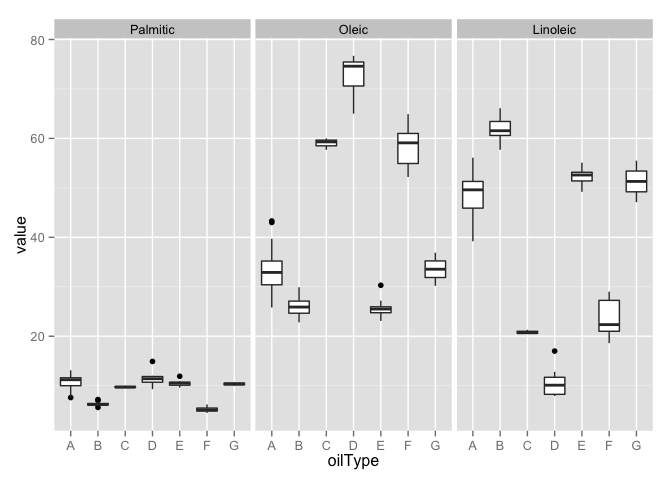
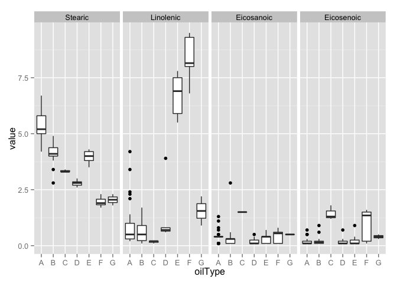
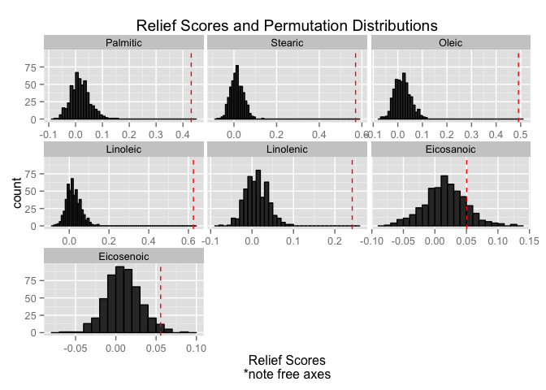

# Ex18.1 Measuring predictor importance: oil data set
Oisin Fitzgerald  
Assessing varaible importance (and model fitting) may be more difficult with
a response factor with multiple levels. This script outlines the quantification
of variable importance in a data set where the response is a factor with seven
levels. The data set describes the fatty acid composition of seven oil types (e.g.
pumpkin (A), sunflower (B)....) measured using gas chromatography. More can be 
found in ?caret::oil.

Four approaches are taken to evaluating predictor importance, answer the following questions:

1. Graphical display of the predictors for each level of the response (boxplots!):
how well separated do the classes appear?
2. Analysis of variance: for each predictor is there more variance between rather
than within the response categories?
3. Area under the ROC curve: what is the ability of a predictor to separate classes?
4. ReliefF (incl permutation test): what is the ability of a predictor to separate classes and is this greater than would occur by chance?

```r
# load data
library(caret)
```

```
## Loading required package: lattice
## Loading required package: ggplot2
```

```r
data(oil)
str(oilType)
```

```
##  Factor w/ 7 levels "A","B","C","D",..: 1 1 1 1 1 1 1 1 1 1 ...
```

```r
str(fattyAcids)
```

```
## 'data.frame':	96 obs. of  7 variables:
##  $ Palmitic  : num  9.7 11.1 11.5 10 12.2 9.8 10.5 10.5 11.5 10 ...
##  $ Stearic   : num  5.2 5 5.2 4.8 5 4.2 5 5 5.2 4.8 ...
##  $ Oleic     : num  31 32.9 35 30.4 31.1 43 31.8 31.8 35 30.4 ...
##  $ Linoleic  : num  52.7 49.8 47.2 53.5 50.5 39.2 51.3 51.3 47.2 53.5 ...
##  $ Linolenic : num  0.4 0.3 0.2 0.3 0.3 2.4 0.4 0.4 0.2 0.3 ...
##  $ Eicosanoic: num  0.4 0.4 0.4 0.4 0.4 0.4 0.4 0.4 0.4 0.4 ...
##  $ Eicosenoic: num  0.1 0.1 0.1 0.1 0.1 0.5 0.1 0.1 0.1 0.1 ...
```

```r
# load packages
library(reshape2)
library(CORElearn)
library(AppliedPredictiveModeling)
suppressMessages(library(pROC))
```

### 1. Boxplots 
Although not particularly pretty the boxplots does show that 
oleic and linoleic have the most variation between and within classes.

```r
summary(fattyAcids)
```

```
##     Palmitic        Stearic          Oleic          Linoleic    
##  Min.   : 4.50   Min.   :1.700   Min.   :22.80   Min.   : 7.90  
##  1st Qu.: 6.20   1st Qu.:3.475   1st Qu.:26.30   1st Qu.:43.10  
##  Median : 9.85   Median :4.200   Median :30.70   Median :50.80  
##  Mean   : 9.04   Mean   :4.200   Mean   :36.73   Mean   :46.49  
##  3rd Qu.:11.12   3rd Qu.:5.000   3rd Qu.:38.62   3rd Qu.:58.08  
##  Max.   :14.90   Max.   :6.700   Max.   :76.70   Max.   :66.10  
##    Linolenic       Eicosanoic      Eicosenoic    
##  Min.   :0.100   Min.   :0.100   Min.   :0.1000  
##  1st Qu.:0.375   1st Qu.:0.100   1st Qu.:0.1000  
##  Median :0.800   Median :0.400   Median :0.1000  
##  Mean   :2.272   Mean   :0.399   Mean   :0.3115  
##  3rd Qu.:2.650   3rd Qu.:0.400   3rd Qu.:0.3000  
##  Max.   :9.500   Max.   :2.800   Max.   :1.8000
```

```r
# prepare data for boxplots
df <- data.frame(fattyAcids, oilType)
df <- melt(df)
```

```
## Using oilType as id variables
```

```r
df1 <- df[df$variable %in% c("Linoleic", "Oleic", "Palmitic"), ]
df2 <- df[!(df$variable %in% c("Linoleic", "Oleic", "Palmitic")), ]
# for linoleic and oleic
ggplot(data = df1, aes(y = value, x = oilType)) + 
  geom_boxplot() +
    facet_grid(. ~variable)
```

 

```r
# the remaining variables
ggplot(data = df2, aes(y = value, x = oilType)) + 
  geom_boxplot() +
    facet_grid(. ~variable)
```

 

### 2. ANOVA
By modelling the fatty acids as the dependent variables and the oil 
types as the independent variables (a realistic description of the original
experiment) we can gain an understanding of likely differences between the means of 
factor levels for each fatty acid. The results suggest there are differences, although
an ANOVA won't indicate where the difference lie. Computing pairwise t-tests would
be required for this, but the amount of numbers to compare in this case is prohibitive compared to other methods.

```r
anova_res <- function(x, y) {
  test <- anova(lm(x ~ y))
  out <- c(F_value = test$`F value`[1], p_value = test$`Pr(>F)`[1])
  out
}
anova_data <- apply(fattyAcids, MARGIN = 2, FUN = anova_res, y = oilType)
anova_data <- data.frame(t(anova_data))
anova_data[order(anova_data$p_value, decreasing = FALSE), ]
```

```
##               F_value      p_value
## Linoleic   317.956365 7.400916e-58
## Oleic      283.022304 1.018427e-55
## Linolenic  186.689720 3.445215e-48
## Stearic     97.030804 7.197315e-37
## Palmitic    95.029863 1.598196e-36
## Eicosenoic  20.851957 4.033448e-15
## Eicosanoic   5.894469 3.263021e-05
```

```r
# method of pairwise comparison
# pairwise.t.test(x = fattyAcids$Palmitic, g = oilType, pool.sd = FALSE)
```

### 3. ROC and AUC
When there are three or more classes, filterVarImp will compute ROC curves
for each class versus the others and then returns the largest area under the
curve. In this case, with AUCs of 1, there are clearly some predictors that
can perfectly separate one class from the rest (but we could have guessed this
looking at the boxplots!).

```r
# AUC results
auc_res <- filterVarImp(y = oilType, x = fattyAcids)
```

### 4. ReliefF and Permutation Test
The ReliefF algorithm takes a random sample of the data and calculates how far each
observation is from a randomly chosen observation of the same and a different (response) class.

```r
relief_values <- attrEval(oilType ~ ., data = fattyAcids,
  estimator = "ReliefFequalK",  # calculation method
  ReliefIterations = 50)  # num iteration
relief_values[order(relief_values, decreasing = TRUE)]
```

```
##   Linoleic    Stearic      Oleic   Palmitic  Linolenic Eicosanoic 
## 0.63730668 0.54491315 0.52274769 0.43404607 0.24963549 0.10965929 
## Eicosenoic 
## 0.08903402
```

A permutation test adds to the ReliefF algorithm by allowing us to observe how the ReliefF score compares to a distribution of scores calculated on permutated data
(i.e. where no predictor has any *real* relationship to the response)

```r
relief_perm <- permuteRelief(x = fattyAcids, y = oilType, nperm = 500,
  estimator = "ReliefFequalK",
  ReliefIterations = 50)
# format data for plotting
relief_values <- data.frame(Predictor = names(relief_values), 
  value = relief_values, 
  row.names = NULL)
# ggplot: facet wrapped histograms of permutations
ggplot(data = relief_perm$permutations, aes(x = value)) + 
  geom_histogram(binwidth = .01, colour = 1) +
  geom_vline(aes(xintercept = value), relief_values, colour = "red", linetype = 2) +
  facet_wrap(~ Predictor, scales = "free_x") + 
  labs(title = "Relief Scores and Permutation Distributions", 
    x = "Relief Scores\n*note free axes")
```

 


```r
# Standard deviation of permutated distribution from non-permutated score
relief_perm$standardized[order(relief_perm$standardized)]
```

```
## Eicosanoic Eicosenoic  Linolenic   Palmitic      Oleic    Stearic 
##   2.989642   5.748575   9.965823  12.783484  15.531254  16.228189 
##   Linoleic 
##  18.022441
```

